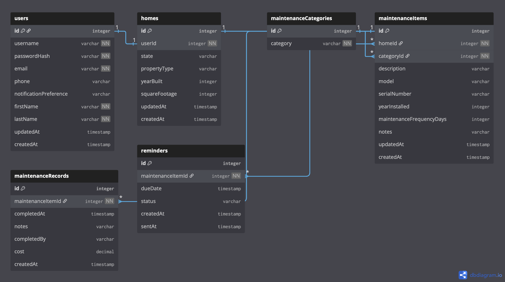

# Home Maintenance Tracker

Full-stack application for tracking home maintenance tasks and reminders.

## Tech Stack

**Backend:**
- Java with Spring Boot
- MySQL database

**Frontend:** (Coming soon)
- React with TypeScript
- Next.js

## Project Structure

- `/backend` - Spring Boot application
- `/frontend` - React/Next.js application

## Database Schema

The application uses a relational MySQL database with the following tables:

### Users
- **Purpose:** Stores user accounts and authentication information
- **Key Fields:** username, email, passwordHash, notificationPreference
- **Relationships:** One-to-one with Homes (each user has one home)

### Homes
- **Purpose:** Tracks property-specific details (property type, square footage, year built, state)
- **Key Fields:** propertyType, yearBuilt, squareFootage, state
- **Relationships:** 
  - One-to-one with Users
  - One-to-many with MaintenanceItems

### MaintenanceCategories
- **Purpose:** Defines types of maintenance (HVAC, Plumbing, Lawn Care, Exterior, etc.)
- **Key Fields:** category (name)
- **Relationships:** One-to-many with MaintenanceItems

### MaintenanceItems
- **Purpose:** Represents specific maintenance items in a home (e.g., furnace, water heater, air filter)
- **Key Fields:** description, model, serialNumber, yearInstalled, maintenanceFrequencyDays
- **Relationships:** 
  - Many-to-one with Homes (many items belong to one home)
  - Many-to-one with MaintenanceCategories (many items share one category)
  - One-to-many with MaintenanceRecords
  - One-to-many with Reminders

### MaintenanceRecords
- **Purpose:** Logs completed maintenance activities with details and costs
- **Key Fields:** completedAt, completedBy, cost, notes
- **Relationships:** Many-to-one with MaintenanceItems (one item can have many records)

### Reminders
- **Purpose:** Manages automatic reminders for upcoming maintenance and tracks notification history
- **Key Fields:** dueDate, status (pending/sent/completed), sentAt
- **Relationships:** Many-to-one with MaintenanceItems (one item can have many reminders)

## Entity Relationship Diagram

## Getting Started

See individual README files in each directory for setup instructions.